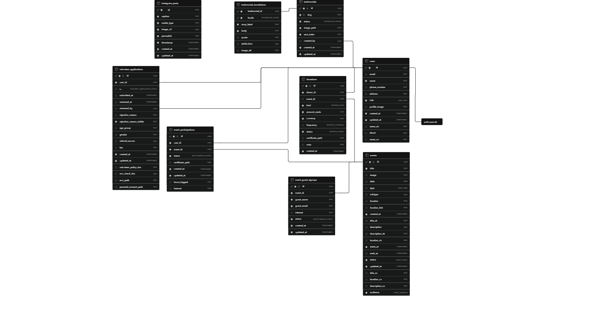

# Love 21 Project

### About This Project
This is a modern Next.js App Router implementation of the LOVE 21 Foundation website, supporting both English and Traditional Chinese (zh-HK). It integrates Supabase for secure authentication, database storage, and asset management, creating a highly interactive experience for members, volunteers, and donors.

### Unique Features
* **Instagram Feed Sync**: Automatically retrieves and syncs posts from Instagram via webhooks, storing them in Supabase to display cached social feeds on the stories page.
* **Downloadable E-Certificates**: Dynamically generates download-ready HTML e-certificates with custom metrics for both donors (reflecting their support totals) and volunteers (reflecting their contribution hours).
* **Staff/Admin Portal**: A staff-only portal accessible at `/admin` that allows administrators to review volunteer applications, compile testimonials, and schedule calendar events.
* **Contributor Portal**: An client-side localized workspace where volunteers and donors can manage registrations, check their logged hours or donations, and update profile metadata.

---

### Prerequisites
* Node.js `>=20`
* npm

### Quick Start
1. **Install dependencies**:
   ```bash
   npm install
   ```
2. **Configure your keys**:
   Create a `.env.local` file at the root:
   ```dotenv
   NEXT_PUBLIC_SUPABASE_URL=https://<project-ref>.supabase.co
   NEXT_PUBLIC_SUPABASE_ANON_KEY=<publishable-key>
   SUPABASE_SERVICE_ROLE_KEY=<secret-service-key>
   ```
3. **Deploy database migrations**:
   ```bash
   npx supabase link --project-ref <project-ref>
   npm run db:push
   ```
4. **Configure Auth Redirects**:
   In the Supabase dashboard (Auth → URL Configuration), add `http://localhost:3000` as the Site URL and `http://localhost:3000/auth/callback` under Redirect URLs.
5. **Launch development server**:
   ```bash
   npm run dev
   ```

---

### Database Setup & Schema
Deploy fresh migrations by running:
```bash
npm run db:push
```
To update the schema, add a new migration file under `supabase/migrations/`, apply it via `npm run db:push`, and regenerate TypeScript interfaces using `npm run db:types`.

Here is the database schema diagram:


---

### Authentication
* Authenticated sessions are managed securely via `@supabase/ssr` cookies and validated on each request by Next.js Middleware.
* Public registrations default to roles like `member`, `donor`, or `volunteer`.
* Staff/Admin access is promoted server-side from your terminal:
  ```bash
  npm run staff:promote -- admin@example.com
  ```

---

### Database Troubleshooting
* **`supabase: command not found`**: Run commands prefixed with `npx` (e.g. `npx supabase link`) or install it globally.
* **`Supabase is not configured`**: Make sure your local `.env.local` variables are present and restart the development server.
* **Email confirmation errors**: Ensure that the user clicked the confirmation link in their email inbox, and check that your redirect URLs match `http://localhost:3000/auth/callback`.
* **RLS Errors**: Check your schema policies. Row Level Security limits operations to resource owners. Use the server service-role key for backend overrides.
* **`JWT issued at future` (WSL Clock Drift)**: If you are running Supabase via WSL and your machine went to sleep, the WSL container clocks may drift. Fix it by running `sudo hwclock -s` in your WSL terminal, or restarting WSL using `wsl --shutdown`.

---

### Project Shape & Styling
* `app/` — App Router layouts, actions, and pages.
* `components/` — Shared public page experiences and portal components.
* `lib/` — Supabase client wrappers, local storage helpers, and database types.
* `styles/` — Design tokens (`tokens.css`) and global styling variables. Styling is written using camelCase CSS Modules next to components; Tailwind is not used.
* `supabase/` — Database migrations, configurations, and schemas.
